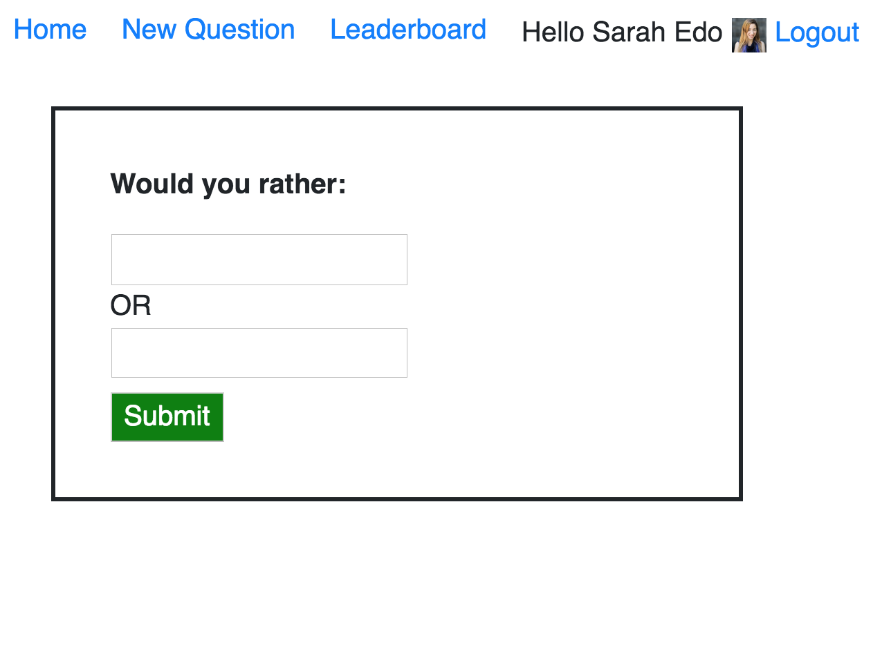

# Would You Rather App

Written with [React](https://reactjs.org/) as UI management and [Redux](https://redux.js.org/) as state management, this is a web app that lets a user play "would you rather" game. The user can create a new question, which offers two options and only one of them can be chosen. The user can also vote questions, see the detailed result of each question, the ranking for each user, and much more. Check out this app to find more.

## How to install

run `npm install`

## How to run

run `npm start`
